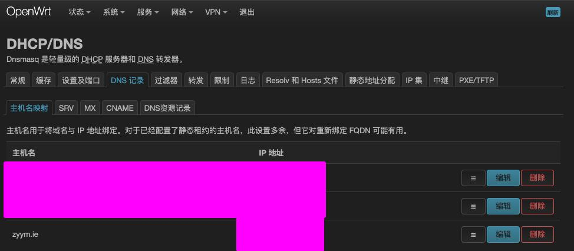

# 在小米垃圾的小爱音箱上播放音乐

## 使用说明

1. 喊：小爱同学
1. 喊：打开小怪
1. 喊：播放服务器的音乐
1. 小爱：🎶🎶🎶

每播放两次就要重新喊一遍

## 安装说明

1. clone 本仓库
1. 根据自己jellyfin的配置修改test.sh
1. 修改路由器劫持域名`zyym.ie`到服务器

1. 执行 `./test.sh`
1. 可以用浏览器先测试下访问 xxxx.lan:65533
1. 参考 「使用说明」 开喊
